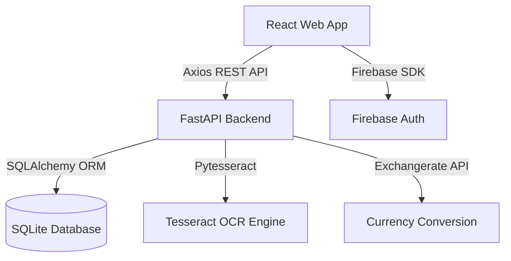

# Reimbursement Management System


<div align="center">

[]()
[]()
[]()
[]()
[]()

**A full-stack, AI-powered system for managing corporate expense reimbursements.**

*Streamline your company's expense workflow with multi-level approvals, OCR receipt scanning, and smart currency conversion.*

</div>

---

## 🚀 Overview

The **Reimbursement Management System** is a next-generation solution for enterprises to handle employee expense claims efficiently. By combining **FastAPI's performance** with **React's interactivity** and **AI-driven OCR**, we've built a system that minimizes manual entry and maximizes transparency.

---

## 🌟 Key Features

### 🛡️ Enterprise-Grade Auth & RBAC
- **Multi-Tenant Scaffolding**: Automatic company workspace generation on signup.
- **Firebase Integration**: Secure Google OAuth and Email/Password flows.
- **Deep RBAC**: Granular dashboard views for Employees, Managers, Admins, and Directors.

### 🤖 AI-Powered Automation
- **Tesseract OCR Engine**: Instantly extracts Merchant, Date, and Amount from receipts.
- **Live Currency Layer**: Integrated with `exchangerate-api` for real-time conversion to base company currency.
- **Smart Validation**: Automated checks to ensure data consistency between OCR and manual input.

### ⚙️ Customizable Rule Engine
Admins can define complex approval logic without writing a single line of code:
- **Threshold-Based Approval**: Auto-approve expenses if a specific percentage (e.g., 60%) of the approval chain is met.
- **Executive Override**: Designate specific persons (e.g., CFO) whose approval instantly clears the expense.
- **Sequential Workflows**: Define strict order: `Manager -> Finance -> Director`.

### 📊 Data Visualization & UX
- **Insightful Dashboards**: Interactive charts powered by **Recharts** for spending analysis.
- **Visual Timelines**: Transparent tracking of every approval step for employees.
- **Modern Aesthetics**: Sleek dark/light mode support with Glassmorphism UI elements.

---

## 🏗️ Technical Architecture



---

## 🛠️ Tech Stack

### **Frontend**
- **Core:** React 18, Vite
- **Styling:** Tailwind CSS, Glassmorphism CSS Modules
- **State & Routing:** React Router v6, Axios
- **Visualization:** Recharts, Framer Motion (for animations)
- **Auth:** Firebase SDK

### **Backend**
- **Framework:** FastAPI
- **Database:** SQLite (SQLAlchemy ORM)
- **OCR:** Pytesseract (Python-Tesseract)
- **Auth Middleware:** Python-Jose (JWT), Passlib
- **Validation:** Pydantic v2

---

## 🚦 Getting Started

### Prerequisites
- **Node.js**: v18+
- **Python**: v3.9+
- **Tesseract OCR**: [Install Guide](https://tesseract-ocr.github.io/tessdoc/Installation.html)

<details>
<summary><b>Step 1: Backend Setup</b></summary>

```bash
cd backend
python -m venv venv
# Windows
.\venv\Scripts\activate 
# Mac/Linux
source venv/bin/activate
pip install -r requirements.txt
python -m uvicorn main:app --reload --port 8000
```
</details>

<details>
<summary><b>Step 2: Frontend Setup</b></summary>

```bash
cd frontend
npm install
npm run dev
```
</details>

<details>
<summary><b>Step 3: Configuration</b></summary>

Create a `frontend/src/utils/firebase.js` and add your Firebase Config:
```javascript
export const firebaseConfig = {
  apiKey: "YOUR_API_KEY",
  authDomain: "YOUR_PROJECT.firebaseapp.com",
  projectId: "YOUR_PROJECT_ID",
  // ... rest of config
};
```
</details>

---

## 🔮 Roadmap & Future Scope
- [ ] **Slack/Teams Integration**: Notifications for pending approvals.
- [ ] **Mobile App**: Dedicated Flutter or React Native mobile scanner.
- [ ] **Predictive Analytics**: AI-based fraud detection for irregular spending patterns.
- [ ] **PDF Support**: Broaden OCR beyond image formats to multi-page PDFs.

---

## ⚖️ License & Contributing
Distributed under the **MIT License**. We welcome contributions - feel free to open a PR or Issue!
